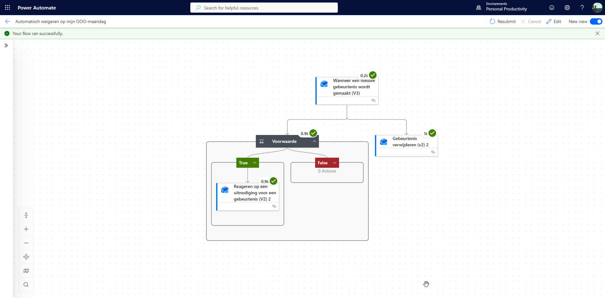

# Auto decline invites on OOO


---



## Purpose
Do you have a work roster that does not follow the standard Monday-to-Friday schedule?  
I take every alternate Monday off as a compensatory day, and I want to avoid meetings being booked on those days.  

This Power Automate flow automatically detects new calendar events on my OOO (out-of-office) days, politely declines them, and can optionally remove the event from my calendar. No awkward emails or missed notifications, the flow takes care of it.

---

## 📖 Setup Guide
For step-by-step instructions on how to set up this flow, see [Setup Instructions](docs/instructions.md).

---

## 1. Overview

This flow performs the following steps:

1. **Trigger:** Runs every 5 minutes to check for new calendar events.  
2. **Condition:** Checks whether the organizer is **not you**.  
3. **Respond to Event:** Declines the meeting automatically and sends a polite message to the organizer (only if you are not the organizer).  
4. **Delete Event (optional):** Removes the event from the calendar entirely.

The flow uses the **Office 365 Outlook** connector.

---

## 2. Flow Components
### 2.1 Trigger: Get New Calendar Items

```json
{
    "inputs": {
        "host": {
            "connectionName": "shared_office365",
            "operationId": "CalendarGetOnNewItemsV3",
            "apiId": "/providers/Microsoft.PowerApps/apis/shared_office365"
        },
        "parameters": {
            "table": "<CALENDAR_ID>"
        },
        "authentication": "@parameters('$authentication')"
    },
    "recurrence": {
        "interval": 5,
        "frequency": "Minute"
    },
    "metadata": {
            "operationMetadataId": "<OPERATION_METADATA_ID>"
    },
    "splitOn": "@triggerOutputs()?['body/value']"
}
```
* **Recurrence**: Every 5 minutes  
* **Split On**: Processes each new calendar event individually

### 2.2 Condition: Skip Events You Organized
* Check: organizer.email != your.email
* Yes branch: Event is not yours → Respond to Event (Decline) + Delete Event (Parallel)
* No branch: Event is yours → Skip

> **Note:** The "Delete Event" action runs **in parallel** with "Respond to Event" because the event ID from the trigger becomes unavailable after responding. Running them in parallel ensures both actions can access the original event ID.


### 2.3 Action: Respond to Event (Decline)
```json
{
    "inputs": {
        "host": {
            "connectionName": "shared_office365",
            "operationId": "RespondToEvent_V2",
            "apiId": "/providers/Microsoft.PowerApps/apis/shared_office365"
        },
        "parameters": {
            "event_id": "@triggerOutputs()?['body/id']",
            "response": "decline",
            "body/Comment": "Hello @{triggerOutputs()?['body/organizer']},\nI’ll be out of the office this Monday for a compensatory day off. Any meetings scheduled for this day have already been, or will be, automatically declined.\n\nThank you for your understanding.\n\nBest regards,\n<YOUR_NAME>",
            "body/SendResponse": true
        },
        "authentication": "@parameters('$authentication')"
    },
    "metadata": {
            "operationMetadataId": "<OPERATION_METADATA_ID>"
    }
}

```
* Automatically declines the meeting
* Sends a polite message to the organizer
* `body/SendResponse: true` ensures the organizer sees the declined status

### 2.4 Action: Delete Calendar Event (Parallel with Respond)
```json
{
    "inputs": {
        "host": {
            "connectionName": "shared_office365",
            "operationId": "CalendarDeleteItem_V2",
            "apiId": "/providers/Microsoft.PowerApps/apis/shared_office365"
        },
        "parameters": {
            "calendar": "<CALENDAR_ID>",
            "event": "@triggerOutputs()?['body/id']"
        },
        "authentication": "@parameters('$authentication')"
    },
    "metadata": {
            "operationMetadataId": "<OPERATION_METADATA_ID>"
    },
    "runAfter": {},
    "type": "ApiConnection"
}
```
* Deletes the event from your calendar

